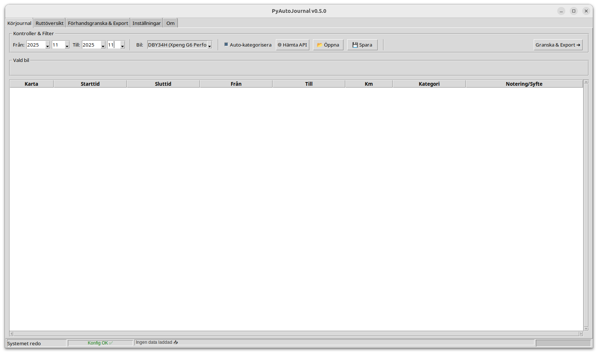
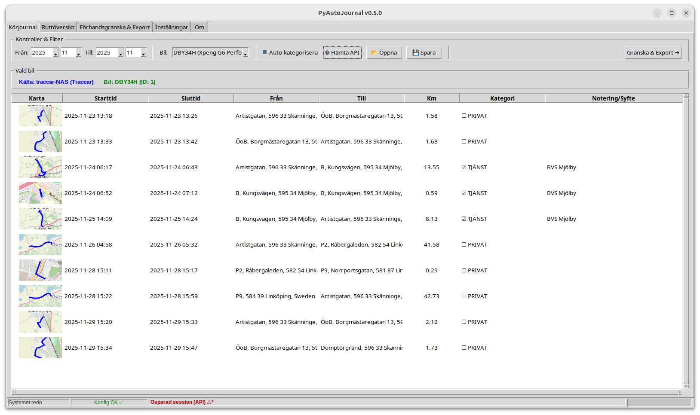
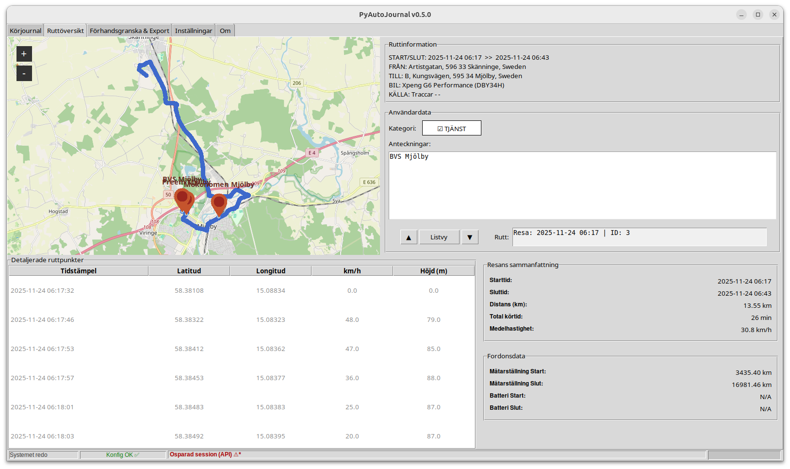
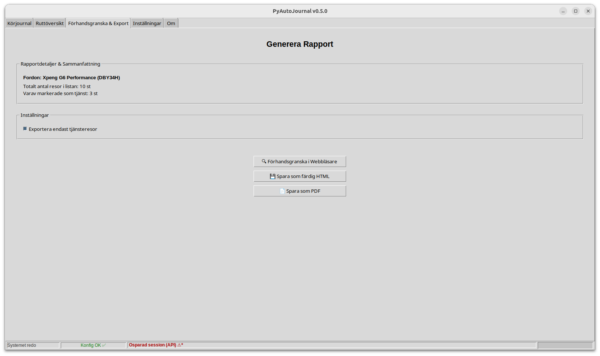
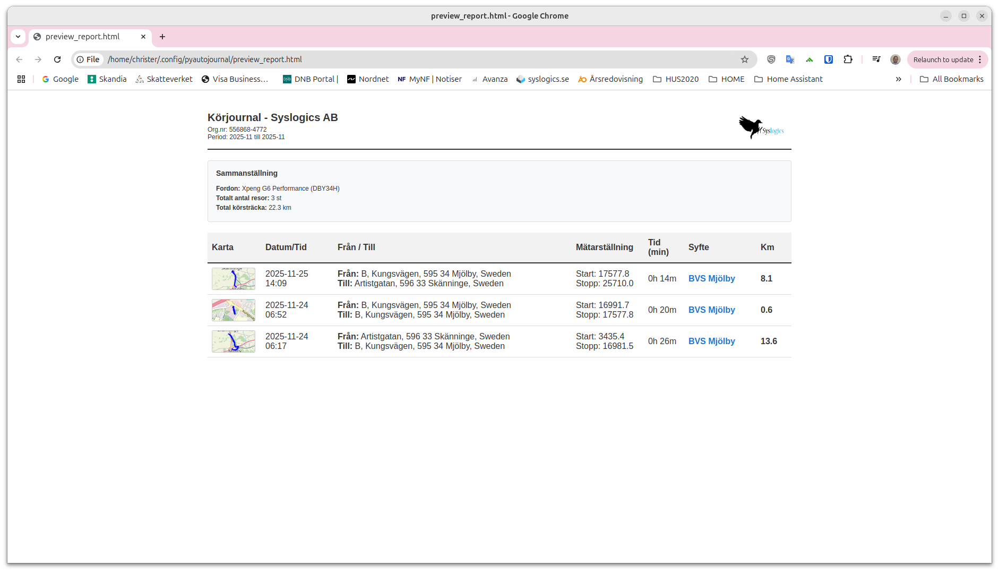
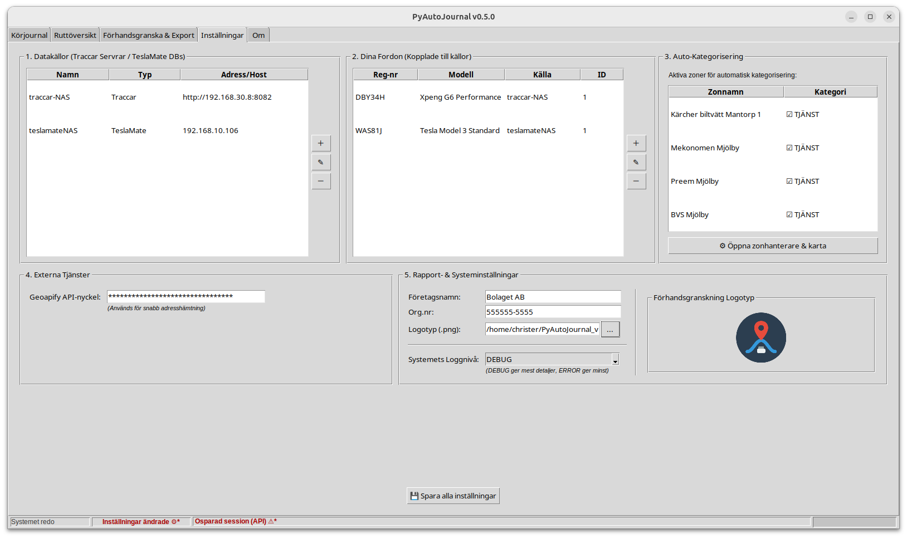
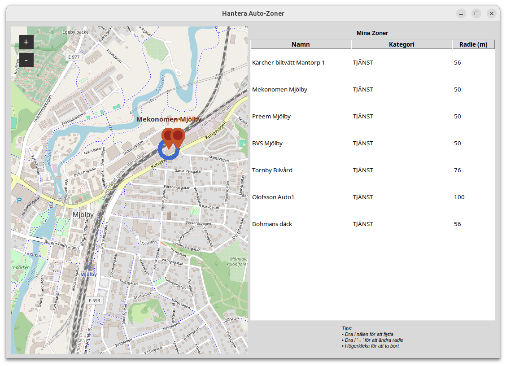

# PyAutoJournal

PyAutoJournal är ett grafiskt verktyg (byggt i Python/Tkinter) för att automatiskt hämta, kategorisera och exportera körjournaler från GPS-källor som **Traccar** och **TeslaMate**. Perfekt för att skapa körjournaler för Skatteverket med minimal handpåläggning.

## ✨ Nyckelfunktioner
* **Dual-Source Support:** Växla sömlöst mellan TeslaMate och Traccar.
* **Intelligent Statusbar:** Realtidsfeedback med färgkodade indikatorer för:
    * 🟢 **Konfig OK:** Allt är sparat och redo.
    * 🔴 **Osparade ändringar:** Varning om ändringar i inställningar eller session.
    * ⚙️ **Arbetar:** Visar när nätverksanrop eller filskrivning pågår.
* **Auto-Kategorisering:** Definiera zoner (t.ex. "Hem", "Kontor") för automatisk märkning av tjänsteresor vs. privatresor.
* **Robust Export:** PDF-rapporter med inbäddade kartor, optimerade för utskrift.
* **Trådsäker hantering:** Bakgrundshämtning av data så att gränssnittet aldrig fryser.

## 📸 Skärmdumpar

## Arkitektur & Design
Applikationen följer en tydlig arkitektur för att separera logik från användargränssnitt, vilket gör projektet lätt att underhålla och vidareutveckla.

* **GUI-lager (`src/gui_handler.py` & Co):** Ansvarar för användarinteraktion och rendering av vyer. Alla fönster är byggda med `tkinter` och `ttk`.
* **Logik-lager (`src/data_manager.py`):** Fungerar som "hjärnan" i applikationen. Den koordinerar datahämtning, adressuppslagningar och bearbetning.
* **Datakällor (`src/data_fetcher.py`, `src/data_processor.py`):** Hanterar rådata från API:er och databaser samt omvandlar det till läsbara reseloggar.

## 🚀 Installation
Insatallera från grunden genom att följa dessa steg:

1. Klona repot: `git clone https://github.com/ditt-anvandarnamn/PyAutoJournal.git`
2. Installera beroenden: `pip install -r requirements.txt`
3. Starta programmet: `python main.py`

### 2. 🛠 Krav för PDF-export
För att kunna generera PDF-rapporter använder PyAutoJournal verktyget `wkhtmltopdf`. Detta måste installeras separat på ditt operativsystem:

* **Windows:** Ladda ner och kör installatören från [wkhtmltopdf.org](https://wkhtmltopdf.org/downloads.html). **Viktigt:** Se till att välja "Add to PATH" under installationen.
* **Linux (Ubuntu/Debian):** Kör `sudo apt install wkhtmltopdf`.
* **macOS:** Kör `brew install wkhtmltopdf`.

## 🛠️ Byggt med
* [Tkinter & TkinterMapView](https://github.com/TomSchimansky/TkinterMapView) - GUI och inbyggda kartor
* [Folium](https://python-visualization.github.io/folium/) - HTML-kartgenerering
* [Psycopg2](https://pypi.org/project/psycopg2/) - Databaskoppling mot TeslaMate

## ⚖️ Licens
Detta projekt är licensierat under **MIT-licensen**. Se filen `LICENSE` för fullständig text.

*Skapat med ❤️  för att förenkla vardagen för bilister som måste rapportera in körjournal till skatteverket.*
